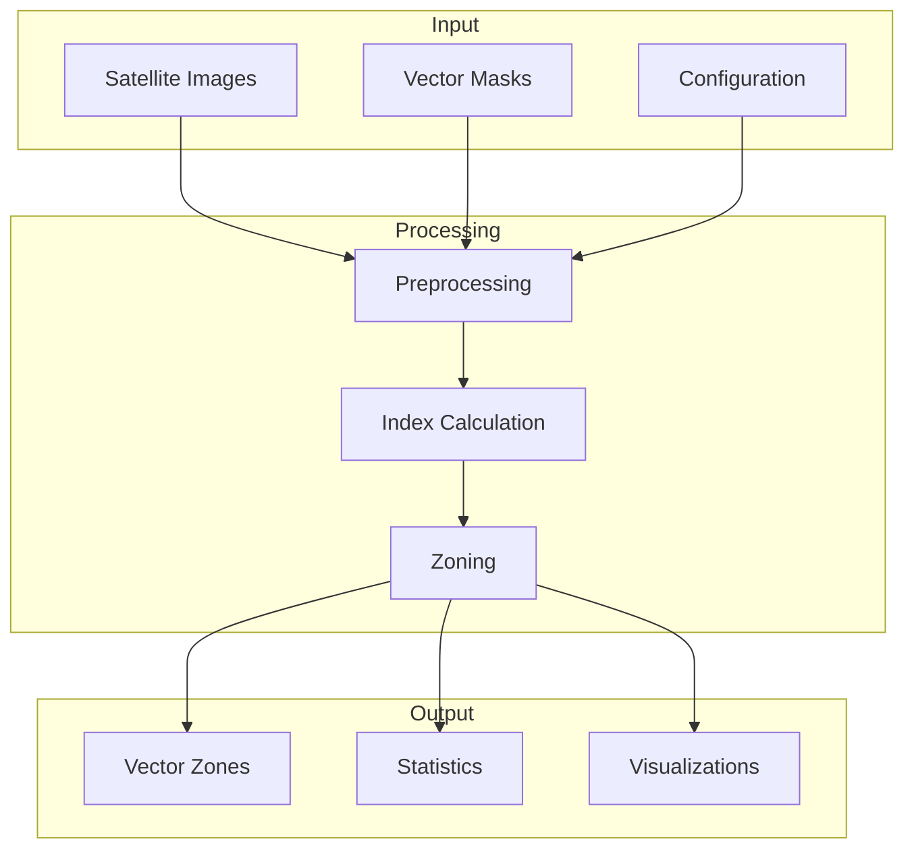

# PASCAL NDVI Block System Architecture

© 2025 AustralMetrics SpA. All rights reserved.

## Table of Contents

1. [Overview](#overview)
2. [Main Components](#main-components)
3. [Data Flow](#data-flow)
4. [Interfaces](#interfaces)
5. [Technologies](#technologies)
6. [Security](#security)
7. [Scalability](#scalability)
8. [Monitoring](#monitoring)

## Overview

### Purpose
The PASCAL NDVI Block system is designed to perform analysis and zoning of agricultural fields using multispectral satellite imagery. The architecture is optimized for:

- Efficient processing of large data volumes
- Horizontal and vertical scalability
- ISO 42001 compliance
- Maintainability and extensibility

### General Architecture



## Main Components

### 1. Input Module
```python
class InputModule:
    """
    Manages input data loading and validation
    """
    def __init__(self, config: Config):
        self.config = config
        self.validators = self._init_validators()

    def load_image(self) -> RasterData:
        """Loads and validates satellite image"""

    def load_mask(self) -> VectorData:
        """Loads and validates vector mask"""
```

### 2. Processing Engine
```python
class ProcessingEngine:
    """
    Coordinates the main processing flow
    """
    def __init__(self):
        self.indices_calculator = IndicesCalculator()
        self.zoning_engine = ZoningEngine()
        self.validator = DataValidator()

    def run_pipeline(self, data: InputData) -> Results:
        """Executes the complete processing pipeline"""
```

### 3. Export System
```python
class ExportSystem:
    """
    Handles result generation and export
    """
    def export_zones(self, zones: GeoDataFrame) -> None:
        """Exports zones in GeoPackage format"""

    def export_statistics(self, stats: DataFrame) -> None:
        """Exports statistics in CSV format"""

    def generate_visualizations(self, data: Results) -> None:
        """Generates maps and charts"""
```

## Data Flow

### 1. Data Ingestion

#### Supported Formats
- **Raster**: GeoTIFF (16/32-bit)
- **Vector**: GeoPackage, Shapefile
- **Config**: YAML, JSON

#### Input Validation
```python
def validate_input(raster: Path, vector: Path) -> bool:
    """
    Verifies data integrity and compatibility
    - Format and structure
    - Coordinate system
    - Spatial coverage
    - Memory requirements
    """
```

### 2. Processing

#### Main Pipeline
1. Preprocessing
   - Image clipping
   - Normalization
   - NoData validation

2. Index Calculation
   - NDVI
   - SAVI
   - Additional metrics

3. Zoning
   - K-means clustering
   - Zone optimization
   - Result validation

### 3. Result Generation

#### Output Formats
- **Zones**: GeoPackage (.gpkg)
- **Statistics**: CSV, JSON
- **Visualizations**: PNG, PDF

## Interfaces

### 1. Python API
```python
from pascal_zoning import AgriculturalZoning

zoning = AgriculturalZoning(
    input_file="field.tif",
    output_dir="results",
    k_clusters=3
)
results = zoning.run_pipeline()
```

### 2. CLI
```bash
pascal-zoning process \
    --input field.tif \
    --output results \
    --clusters 3 \
    --min-zone 0.5
```

### 3. Events and Callbacks
```python
def on_progress(step: str, percent: float):
    """Progress callback"""

def on_complete(results: Results):
    """Completion callback"""

zoning.add_progress_listener(on_progress)
zoning.add_completion_listener(on_complete)
```

## Technologies

### Core
- Python 3.11+
- NumPy/Pandas
- Rasterio/GDAL
- Geopandas
- Scikit-learn

### Infrastructure
- Version Control: Git
- Documentation: Markdown/Sphinx
- Testing: Pytest
- CI/CD: GitHub Actions

## Security

### Access Control
- Path validation
- Input sanitization
- Resource control

### Auditing
- Detailed logging
- ISO 42001 traceability
- Integrity verification

## Scalability

### Vertical
- Parallel processing
- Optimized memory management
- Large data chunking

### Horizontal (Future)
- Distributed processing
- Cloud storage
- REST APIs

## Monitoring

### Operational Metrics
- Memory usage
- Processing time
- Success/error rate

### Logging
```python
def setup_logging(output_dir: Path) -> None:
    """
    Configures ISO 42001 logging system
    - Log rotation
    - Severity levels
    - Standardized formats
    """
```

### Alerts
- Critical errors
- Excessive resource usage
- Validation failures

## Implementation Considerations

### Design Patterns
- Factory for object creation
- Strategy for algorithms
- Observer for events
- Command for operations

### Error Handling
```python
class ZoningError(Exception):
    """Base for zoning errors"""

class ValidationError(ZoningError):
    """Data validation error"""

class ProcessingError(ZoningError):
    """Processing error"""
```

### Configuration
```yaml
# config.yaml
processing:
  max_image_size_gb: 10.0
  chunk_size_mb: 512
  threads: 4

validation:
  min_zone_size_ha: 0.5
  max_zones: 10
  allowed_crs:
    - EPSG:32719
    - EPSG:32720

output:
  formats:
    - gpkg
    - csv
    - png
  compression: true
  statistics: true
```

## Extensibility

### Extension Points
1. New vegetation indices
2. Clustering algorithms
3. Export formats
4. Visualizations

### Plugins (Future)
```python
class IndicesPlugin(Protocol):
    """Interface for index plugins"""
    def calculate(self, red: np.ndarray, nir: np.ndarray) -> np.ndarray:
        """Calculates custom index"""
```

## References

### Standards
- ISO 42001:2024 - AI Management Systems
- OGC GeoPackage
- GeoJSON RFC 7946

### Main Libraries
- rasterio >= 1.3.8
- geopandas >= 0.14.0
- scikit-learn >= 1.3.0
- numpy >= 1.24.0

### Related Documentation
- [User Guide](user_guide/user_guide.md)
- [Technical Documentation](technical/technical_documentation.md)
- [Functions Reference](technical/functions_reference.md)
- [Examples](examples/advanced_examples.md)