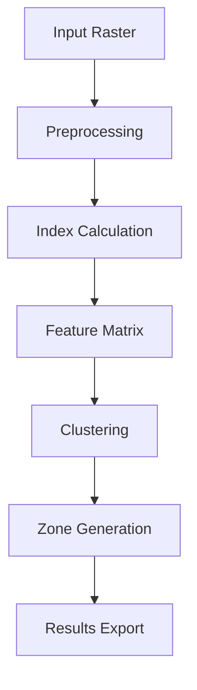

# PASCAL NDVI Block Technical Documentation

© 2025 AustralMetrics SpA. All rights reserved.

## Table of Contents

1. [System Architecture](#system-architecture)
   - Core Components
   - Data Flow
   - Processing Pipeline

2. [Algorithms & Methods](#algorithms--methods)
   - Vegetation Indices
   - Clustering Methods
   - Sampling Strategies

3. [Data Management](#data-management)
   - Input Formats
   - Output Specifications
   - Data Validation

4. [Performance Considerations](#performance-considerations)
   - Memory Management
   - Processing Optimization
   - Hardware Requirements

5. [Security & Compliance](#security--compliance)
   - ISO 42001 Implementation
   - Data Protection
   - Access Control

## System Architecture

### Core Components

1. **Input Processing Module**
   - Raster data loading
   - Format validation
   - Coordinate system handling

2. **Index Calculation Engine**
   - Multithreaded processing
   - Memory-efficient operations
   - Precision control

3. **Clustering System**
   - K-means implementation
   - Cluster validation
   - Zone optimization

4. **Export Module**
   - GeoPackage generation
   - Statistics calculation
   - Visualization rendering

### Data Flow



### Processing Pipeline

1. **Data Loading**
   - Validate input format
   - Check coordinate system
   - Verify data integrity

2. **Preprocessing**
   - Apply masks
   - Handle nodata values
   - Scale values

3. **Analysis**
   - Calculate indices
   - Generate features
   - Perform clustering

4. **Results Generation**
   - Create vector zones
   - Calculate statistics
   - Generate visualizations

## Algorithms & Methods

### Implemented Vegetation Indices

### NDVI (Normalized Difference Vegetation Index)

```python
def calculate_ndvi(red_band: np.ndarray, nir_band: np.ndarray) -> np.ndarray:
    """
    NDVI = (NIR - RED) / (NIR + RED)
    Range: -1.0 to 1.0
    """
```

#### Technical Specifications
- **Formula**: NDVI = (NIR - RED) / (NIR + RED)
- **Value Range**: -1.0 to 1.0
- **Interpretation**:
  - < 0: Water, artificial surfaces
  - 0.0 - 0.2: Bare soil
  - 0.2 - 0.4: Sparse vegetation
  - 0.4 - 0.6: Moderate vegetation
  - > 0.6: Dense vegetation

#### Implementation Details
- Input validation for array dimensions
- NaN/Inf handling
- Memory-efficient computation
- Vectorized operations

### SAVI (Soil Adjusted Vegetation Index)

```python
def calculate_savi(red_band: np.ndarray, nir_band: np.ndarray, L: float = 0.5) -> np.ndarray:
    """
    SAVI = ((NIR - RED) / (NIR + RED + L)) * (1 + L)
    Soil adjustment factor L ranges from 0 to 1
    """
```

#### Technical Specifications
- **Formula**: SAVI = ((NIR - RED) / (NIR + RED + L)) * (1 + L)
- **L Factor**: Soil brightness correction factor
  - L = 0: High vegetation cover
  - L = 0.5: Intermediate vegetation
  - L = 1.0: Low vegetation cover
- **Value Range**: -1.0 to 1.0

#### Implementation Details
- L factor validation (0 ≤ L ≤ 1)
- Optimized computation
- Error handling for edge cases

### Clustering Methods

#### K-means Implementation

```python
def perform_clustering(
    feature_matrix: np.ndarray,
    k_clusters: int,
    **kwargs
) -> Tuple[np.ndarray, Dict[str, float]]:
    """
    Performs K-means clustering with optimized initialization
    """
```

#### Technical Specifications
- **Algorithm**: K-means++
- **Distance Metric**: Euclidean
- **Initialization**: Smart initialization strategy
- **Convergence**: Maximum iterations or tolerance

#### Quality Metrics
- Silhouette coefficient
- Inertia
- Calinski-Harabasz index
- Davies-Bouldin index

### Sampling Strategy

#### Point Generation

```python
def generate_sampling_points(
    zones_gdf: gpd.GeoDataFrame,
    points_per_zone: int,
    min_distance: float
) -> gpd.GeoDataFrame:
    """
    Generates stratified sampling points within zones
    """
```

#### Technical Details
- Stratified random sampling
- Minimum distance constraint
- Edge buffer handling
- Area-weighted distribution## Data Management

### Input Data Specifications

#### Supported Formats
- **Primary**: GeoTIFF (.tif, .tiff)
- **Vector Masks**: Shapefile (.shp), GeoPackage (.gpkg)
- **Configuration**: YAML (.yaml, .yml), JSON (.json)

#### Input Requirements
- **Raster Properties**:
  - Bit Depth: 16-bit or 32-bit float
  - Coordinate System: Any projected CRS
  - Bands: Red and NIR required
  - Cloud Coverage: < 50%

- **Vector Properties**:
  - Type: Polygon features
  - Attributes: Optional zone IDs
  - CRS: Must match or be transformable to raster CRS

### Data Validation

#### Input Validation
```python
def validate_input_data(
    raster_path: Path,
    mask_path: Optional[Path] = None
) -> bool:
    """
    Validates input data format and content
    """
```

- **Raster Checks**:
  - File integrity
  - Band count and order
  - Value ranges
  - NoData handling
  - Memory requirements

- **Vector Checks**:
  - Geometry validity
  - CRS compatibility
  - Attribute conformity
  - Spatial relationship

### Output Specifications

#### File Outputs
1. **Vector Results**:
   - Format: GeoPackage (.gpkg)
   - Contents:
     - Zone polygons
     - Sampling points
     - Zone statistics

2. **Raster Derivatives**:
   - Format: GeoTIFF (.tif)
   - Types:
     - Index maps (NDVI, SAVI)
     - Zone raster
     - Confidence maps

3. **Metadata & Reports**:
   - Format: JSON, CSV
   - Contents:
     - Processing parameters
     - Quality metrics
     - Zone statistics
     - Execution logs

#### Data Quality Controls
- Topology validation
- Statistical outlier detection
- Completeness verification
- Format compliance

## Performance Considerations

### Memory Management

#### Chunked Processing
```python
def process_in_chunks(
    raster: rasterio.DatasetReader,
    chunk_size: int = 1024
) -> Iterator[np.ndarray]:
    """
    Processes raster data in memory-efficient chunks
    """
```

- **Chunk Size Calculation**:
  ```python
  chunk_size = min(
      1024,  # Default size
      max(128, available_memory // (width * bytes_per_pixel))
  )
  ```

- **Memory Monitoring**:
  - Active memory tracking
  - Automatic garbage collection
  - Resource limit enforcement

#### Optimization Techniques

1. **Data Loading**
   - Lazy loading
   - Memory mapping for large files
   - Buffer management

2. **Computation**
   - Vectorized operations
   - Parallel processing
   - GPU acceleration (when available)

3. **Output Generation**
   - Streaming writes
   - Compressed outputs
   - Progressive rendering

### Hardware Requirements

#### Minimum Specifications
- **CPU**: Dual-core, 2.0 GHz
- **RAM**: 8 GB
- **Storage**: 10 GB free space
- **Network**: 10 Mbps (for satellite data)

#### Recommended Specifications
- **CPU**: Quad-core, 3.0+ GHz
- **RAM**: 16+ GB
- **Storage**: 50+ GB SSD
- **Network**: 100+ Mbps

#### Performance Scaling
| Image Size (GB) | RAM Required | Processing Time | Disk Space |
|----------------|--------------|-----------------|------------|
| 0.5            | 4 GB         | ~2 min         | 2 GB       |
| 1.0            | 8 GB         | ~5 min         | 4 GB       |
| 2.0            | 16 GB        | ~12 min        | 8 GB       |
| 5.0+           | 32+ GB       | 30+ min        | 20+ GB     |

## Preprocessing

### Image Clipping
```python
def clip_raster(image_path: Path, shapefile_path: Path) -> Path:
    """
    Clips raster image using a shapefile
    """
```
- **Input**: Paths to image and shapefile
- **Output**: Path to clipped image
- **Validation**: Verifies CRS and extent

## Logging System

### Configuration
```python
def setup_logging(output_dir: Path) -> None:
    """
    Configures ISO 42001 compliant logging system
    """
```
- Format: Timestamp, process, user
- Backup: Automatic with SHA-256 hash
- Retention: 90 days by default

## Memory Management

### Block Processing
- Maximum image size: 10GB
- Processing in 1024x1024 chunks
- Monitored memory usage

## Limits and Validations

### Input Validations
- Supported formats: GeoTIFF
- Satellites: Sentinel-2, Landsat 8
- Cloud coverage: <50%

### Output Validations
- NDVI value range: [-1, 1]
- SAVI value range: [-1, 1]
- Preserved metadata

## APIs and Functions

### Main Function
```python
def process_image(
    image_path: Path,
    output_dir: Path,
    indices: List[str],
    savi_l: float = 0.5
) -> Dict[str, Path]:
```

### Configurable Parameters
```python
MAX_IMAGE_SIZE_GB = 10.0
DEFAULT_SAVI_L = 0.5
LOG_RETENTION_DAYS = 90
```

## Error Handling

### Controlled Errors
- ImageTooLargeError
- InvalidBandError
- ProcessingError
- ValidationError

### Error Logging
- Complete stacktrace
- Error context
- System state

## Security & Compliance

### ISO 42001 Implementation

#### Traceability Implementation
```python
def log_processing_step(
    step_name: str,
    parameters: Dict[str, Any],
    outputs: Dict[str, Any]
) -> None:
    """
    Logs processing steps according to ISO 42001
    """
```

1. **Process Documentation**
   - Step identification
   - Input/output validation
   - Parameter recording
   - Result verification

2. **Audit Trail**
   - User identification
   - Timestamp precision
   - Action logging
   - Data lineage

3. **Quality Controls**
   - Input validation
   - Output verification
   - Error handling
   - Performance monitoring

#### Security Controls

1. **Access Control**
   ```python
   @requires_permission
   def process_sensitive_data(
       data_path: Path,
       user_context: SecurityContext
   ) -> None:
   ```

   - User authentication
   - Role-based access
   - Permission verification
   - Action auditing

2. **Data Protection**
   - Input validation
   - Output sanitization
   - Path traversal prevention
   - Resource limits

3. **System Security**
   - File permissions
   - Network isolation
   - Resource quotas
   - Secure logging

### Compliance Features

#### Data Privacy
- Personal data handling
- Data minimization
- Access controls
- Audit logging

#### Quality Assurance
- Input validation
- Process verification
- Output quality checks
- Error handling

#### Documentation
- API documentation
- User guides
- Technical specifications
- Compliance reports

### Emergency Procedures

#### Error Recovery
```python
def recover_from_error(
    error_type: Type[Exception],
    context: Dict[str, Any]
) -> bool:
    """
    Implements ISO 42001 compliant error recovery
    """
```

1. **Error Classification**
   - Critical errors
   - Recoverable errors
   - Warning conditions
   - Information events

2. **Recovery Steps**
   - State preservation
   - Data backup
   - System restoration
   - Verification checks

3. **Documentation**
   - Error reporting
   - Recovery actions
   - Verification steps
   - Prevention measures

## Implementation Notes

### Best Practices
- Thread-safe operations
- Resource cleanup
- Error handling
- Performance optimization

### Future Enhancements
- GPU acceleration
- Cloud integration
- Additional indices
- Advanced visualization

## Technical Interfaces

### Data Types and Schemas

#### Input Types
```python
class InputConfig(TypedDict):
    input_file: Path
    output_dir: Path
    k_clusters: int
    min_zone_size: float
    indices: List[str]
    savi_l: Optional[float]
    progress_callback: Optional[Callable[[str, float], None]]
```

#### Output Types
```python
class ZoningResult(TypedDict):
    zones_gpkg: Path           # Zone polygons in GeoPackage format
    points_gpkg: Path         # Sampling points in GeoPackage format
    statistics_csv: Path      # Zone statistics in CSV format
    metrics_json: Path       # Clustering metrics in JSON format
    visualizations: List[Path] # Generated maps and plots
```

### File Format Specifications

#### GeoPackage Schema
```sql
CREATE TABLE zones (
    id INTEGER PRIMARY KEY,
    zone_id INTEGER NOT NULL,
    area_ha REAL NOT NULL,
    ndvi_mean REAL,
    ndvi_std REAL,
    savi_mean REAL,
    savi_std REAL,
    geometry POLYGON NOT NULL
);

CREATE TABLE sampling_points (
    id INTEGER PRIMARY KEY,
    zone_id INTEGER NOT NULL,
    x REAL NOT NULL,
    y REAL NOT NULL,
    ndvi REAL,
    savi REAL,
    geometry POINT NOT NULL
);
```

#### Statistics CSV Format
```csv
zone_id,area_ha,ndvi_mean,ndvi_std,savi_mean,savi_std,perimeter_m,compactness
1,12.5,0.65,0.12,0.48,0.09,1250.0,0.85
2,15.3,0.72,0.08,0.55,0.07,1420.0,0.92
```

### API Endpoints

#### REST API (Future Implementation)
```yaml
/api/v1/zoning:
  post:
    summary: Execute zoning analysis
    requestBody:
      required: true
      content:
        application/json:
          schema:
            $ref: '#/components/schemas/ZoningRequest'
    responses:
      '200':
        description: Successful analysis
        content:
          application/json:
            schema:
              $ref: '#/components/schemas/ZoningResult'
      '400':
        description: Invalid input
      '500':
        description: Processing error
```

### Command Line Interface

```bash
# Basic usage
pascal-zoning process --input <file> --output <dir> --clusters <n>

# Advanced options
pascal-zoning process \
    --input field.tif \
    --output results \
    --clusters 3 \
    --min-zone 0.5 \
    --indices ndvi,savi \
    --savi-l 0.5 \
    --format gpkg,csv,png
```

## Integration Guidelines

### Python API Usage
```python
from pascal_zoning import AgriculturalZoning, ZoningConfig

# Configure zoning
config = ZoningConfig(
    input_file="field.tif",
    output_dir="results",
    k_clusters=3
)

# Initialize and run
zoning = AgriculturalZoning(config)
results = zoning.run_pipeline()
```

### Error Handling
```python
try:
    zoning.run_pipeline()
except ValidationError as e:
    logger.error(f"Input validation failed: {e}")
except ProcessingError as e:
    logger.error(f"Processing failed: {e}")
except Exception as e:
    logger.critical(f"Unexpected error: {e}")
```

### Event System
```python
def progress_callback(step: str, percent: float) -> None:
    print(f"Step: {step}, Progress: {percent:.1f}%")

zoning.add_progress_listener(progress_callback)
zoning.add_completion_listener(lambda r: print("Done!"))
```
