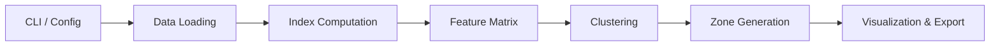

# Pascal Zoning ML — Technical Documentation

**Version:** main  |  **Owner:** AustralMetrics SpA  |  **ISO 42001 Compliant**

This document provides an in-depth overview of the **Pascal Zoning ML** module (repository: `agricultural-zoning-ml`), covering system architecture, algorithms, data management, performance, and security/compliance aspects.

---

## Table of Contents

1. [System Architecture](#system-architecture)
2. [Algorithms & Methods](#algorithms--methods)
3. [Data Management](#data-management)
4. [Performance Considerations](#performance-considerations)
5. [Security & Compliance](#security--compliance)
6. [Interfaces & Usage](#interfaces--usage)

---

## System Architecture

The module is organized into the following core components:

* **Configuration & CLI** (`src/pascal_zoning/interface.py`, `config.py`):

  * Argument parsing (`--raster`, `--indices`, `--output-dir`, etc.)
  * YAML/JSON configuration loader (`load_config`).

* **Secure Logging** (`src/pascal_zoning/logging_config.py`):

  * Structured JSON logs, rotation and backup
  * Audit-trail hooks for ISO 42001 compliance

* **Pipeline Engine** (`src/pascal_zoning/pipeline.py`):

  * Coordinates the full workflow: preprocessing, index integration, feature extraction, clustering, postprocessing
  * Entry point: `PascalZoningPipeline.execute()`

* **Index & Zoning** (`src/pascal_zoning/zoning.py`):

  * Spectral index computations (NDVI, SAVI, NDRE, etc.)
  * Sampling point generation
  * Core clustering logic via K-means++

* **Visualization & Export** (`src/pascal_zoning/viz.py`):

  * Map creation, heatmaps, composite figures
  * Multi-format export (GeoPackage, PNG, CSV, JSON)

### Data Flow Diagram

---

## Algorithms & Methods

### Vegetation Indices

* **NDVI**: `(NIR - RED) / (NIR + RED)`
* **SAVI**: `((NIR - RED) / (NIR + RED + L)) * (1 + L)`
* **Implementation**:

  * Vectorized NumPy operations
  * Dimension checks, division-by-zero handling
  * Parameters validated (`0 ≤ L ≤ 1` for SAVI)

### Clustering

* **Algorithm**: K-means++ (scikit-learn)
* **Metrics**: silhouette score, inertia, Calinski-Harabasz
* **Sampling**: stratified point generation within each zone

### Sampling Strategy

* Function: `generate_sampling_points(zones_gdf, points_per_zone, min_distance)`
* Ensures even spatial coverage and buffer from zone boundaries

---

## Data Management

### Input Specifications

* **Raster**: GeoTIFF (float32), multi-band
* **Config**: YAML or JSON for batch parameters
* **CRS**: Projected (e.g., EPSG:32719)

### Output Specifications

| Artifact           | Format     | Description                                |
| ------------------ | ---------- | ------------------------------------------ |
| Zone polygons      | GeoPackage | `*.gpkg` with per-zone attributes          |
| Sampling points    | GeoPackage | `*.gpkg` with per-point index values       |
| Statistics table   | CSV        | `*.csv` with area, mean/std per index      |
| Clustering metrics | JSON       | `metrics.json` (silhouette, inertia, etc.) |
| Visualizations     | PNG        | Maps and composite figures                 |

### Validation

* Schema and type checks via `pydantic` or custom validators
* Range enforcement (e.g., index values in \[-1,1])
* CRS consistency across inputs and outputs

---

## Performance Considerations

* **Chunked Processing**: Raster stripes to limit memory usage
* **Dimensionality Reduction**: Optional PCA to 95% variance
* **Parallel Execution**: Multi-threading for index computation
* **Benchmarks**:

  * <2 min per 100 MB raster
  * Peak memory <4 GB

### Hardware Recommendations

| Tier        | CPU              | RAM   | Storage    |
| ----------- | ---------------- | ----- | ---------- |
| Minimum     | Dual-core 2 GHz  | 8 GB  | 50 GB SSD  |
| Recommended | Quad-core 3 GHz+ | 16 GB | 200 GB SSD |

---

## Security & Compliance

* **ISO 42001 Adherence**:

  * Full audit trail, timestamped logs
  * Input/output validation hooks
  * Error traceability

* **Access Control**:

  * CLI permissions flags
  * Environment-based secrets management

* **Data Protection**:

  * Path traversal checks
  * Sanitized error messages
  * Configurable log retention (default 90 days)

---

## Interfaces & Usage

Refer to the **Functions Reference** and **NDVI Integration Interface** documents for detailed CLI commands and Python API signatures.

© 2025 AustralMetrics SpA. All rights reserved.

